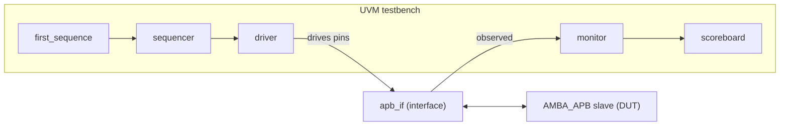
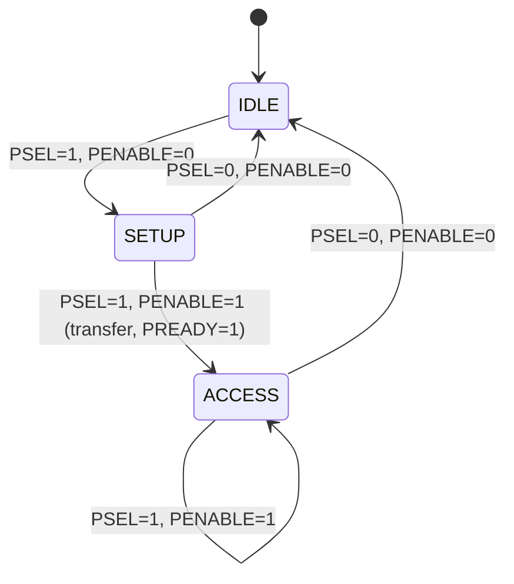

# APB Slave Verification using UVM


A UVM-based verification environment for an **AMBA APB slave** (32 x 32-bit register memory). The testbench drives constrained-random write data to every address, reads it all back, and uses a self-checking scoreboard to confirm the slave returns exactly what was written.

> **Status:** **[FILL IN after your run: e.g. "32/32 read-back comparisons passed, 0 UVM errors."]**

---

## Table of Contents
1. [Overview](#overview)
2. [Key Features](#key-features)
3. [Architecture](#architecture)
4. [Design Under Test](#design-under-test)
5. [Testbench Components](#testbench-components)
6. [Test Scenario](#test-scenario)
7. [How to Run](#how-to-run)
8. [Results](#results)
9. [Limitations and Future Work](#limitations-and-future-work)
10. [Documentation](#documentation)
11. [Author](#author)

---

## Overview

APB (Advanced Peripheral Bus) is part of ARM's AMBA family: a simple, low-power bus used to connect peripherals such as timers, UARTs and register banks. Every APB transfer has two phases:

- **Setup phase:** `PSEL = 1`, `PENABLE = 0`; address and control are presented.
- **Access phase:** `PSEL = 1`, `PENABLE = 1`; data is transferred and the slave answers with `PREADY`.

This project implements a small APB slave and a reusable UVM testbench that verifies its write and read behavior.

## Key Features

- Complete UVM environment: sequence, sequencer, driver, monitor, agent, scoreboard, environment and test.
- APB-compliant driver timing (setup phase, then access phase, waiting for `PREADY`).
- Constrained-random write data (`$urandom`) across the full 32-word address range.
- Passive monitor that reconstructs write and read transactions and sends them to the scoreboard through separate analysis ports.
- Monitor watchdog: raises a `UVM_ERROR` if `PREADY` stays low for more than 10 clock cycles.
- Self-checking scoreboard with per-comparison pass/fail messages and a final pass/fail count in the report phase.

## Architecture



## Design Under Test

`design.sv` implements module `AMBA_APB`:

| Item | Detail |
|---|---|
| Storage | 32 x 32-bit memory |
| Address / data width | 32-bit `PADDR`, `PWDATA`, `PRDATA` |
| Control | `PSEL`, `PENABLE`, `PWRITE`, `PREADY` |
| Clock | Rising edge of `PCLK` (10 ns period in the testbench) |

State machine (IDLE, SETUP, ACCESS):



## Testbench Components

| File | Description |
|---|---|
| `top.sv` | Top module (`apb_top`): clock, reset, DUT and interface instantiation, starts `apb_base_test` |
| `apb_if.sv` | Interface bundling all APB signals |
| `pkg.sv` | Package that includes all UVM classes in dependency order |
| `tx_item.sv` | Sequence item (address, data, control fields; address constrained to 0-31) |
| `first_sequence.sv` | Stimulus: 32 writes then 32 reads |
| `sequencer.sv` | UVM sequencer |
| `driver.sv` | Converts transactions into APB pin activity |
| `monitor.sv` | Observes the bus and publishes write/read transactions |
| `agent.sv` | Groups sequencer, driver and monitor |
| `scoreboard.sv` | Compares written data with read-back data |
| `env.sv` | Environment: agent + scoreboard and their connections |
| `test.sv` | `apb_base_test`: builds the environment and starts the sequence |
| `run.do` | Questa script to compile, simulate and add waves |

## Test Scenario

1. Apply reset, then release it.
2. **Write phase:** write random 32-bit data to addresses 0 through 31.
3. **Read phase:** read addresses 0 through 31.
4. The scoreboard compares each read value with the corresponding written value and reports the totals.

**Pass criteria:** all comparisons match, `UVM_ERROR = 0`, `UVM_FATAL = 0`.

## How to Run

### Questa / ModelSim

```bash
git clone https://github.com/ahmdx-engg/apb-master-slave-verification-using-uvm.git
cd apb-master-slave-verification-using-uvm
vsim -do run.do
```

Or, from inside the Questa transcript window: `cd <repo folder>` then `do run.do`.

For detailed transaction messages, change the `vsim` line in `run.do` to:

```
vsim work.apb_top +UVM_VERBOSITY=UVM_DEBUG +define+UVM_REPORT_DISABLE_FILE_LINE
```

### EDA Playground (no install)

Select **UVM 1.2** and a UVM-capable simulator, paste `design.sv` into the design pane, and add the remaining `.sv` files with the same names. Use a testbench file containing:

```systemverilog
`include "apb_if.sv"
`include "pkg.sv"
`include "top.sv"
```

## Results

**[FILL IN: replace the placeholders below with your own run.]**

**Scoreboard summary:**

```
[PASTE the scoreboard "TEST PASS COUNTS ..." block from your log]
```

**UVM report summary:** `UVM_ERROR : [n]`, `UVM_FATAL : [n]`

**Waveforms:**


Waveform observations to confirm and describe: `PSEL` rises before `PENABLE`; `PREADY` pulses in the access phase; `PRDATA` returns the value written to the same address.

## Limitations and Future Work

- The DUT does not implement `PSLVERR` or `PSTRB`, and there is no error response for addresses outside 0-31.
- Reset is active-high in this implementation (standard APB uses active-low `PRESETn`).
- The scoreboard compares in order using queues and does not index by address.
- The functional coverage collector is not enabled yet.

Planned improvements:

- [ ] Address-indexed reference model in the scoreboard
- [ ] Implement `PSLVERR` for out-of-range addresses and add an error-injection test
- [ ] Add `PSTRB` byte-lane support
- [ ] Functional coverage (read/write, address bins, back-to-back transfers)
- [ ] SystemVerilog Assertions for APB protocol rules
- [ ] Randomized address and operation order

## Documentation

A full project report is available in [`docs/PROJECT_REPORT.md`](docs/PROJECT_REPORT.md).

## Author

**[Your Name]**, [Your degree / university]
[LinkedIn URL] | [Email]

*Reference: ARM AMBA APB Protocol Specification; IEEE 1800.2 (UVM); Accellera UVM User Guide.*
